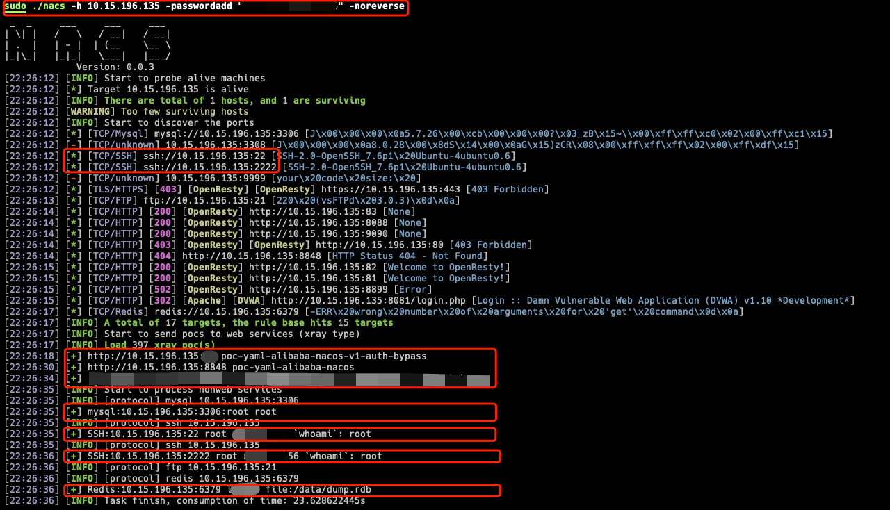
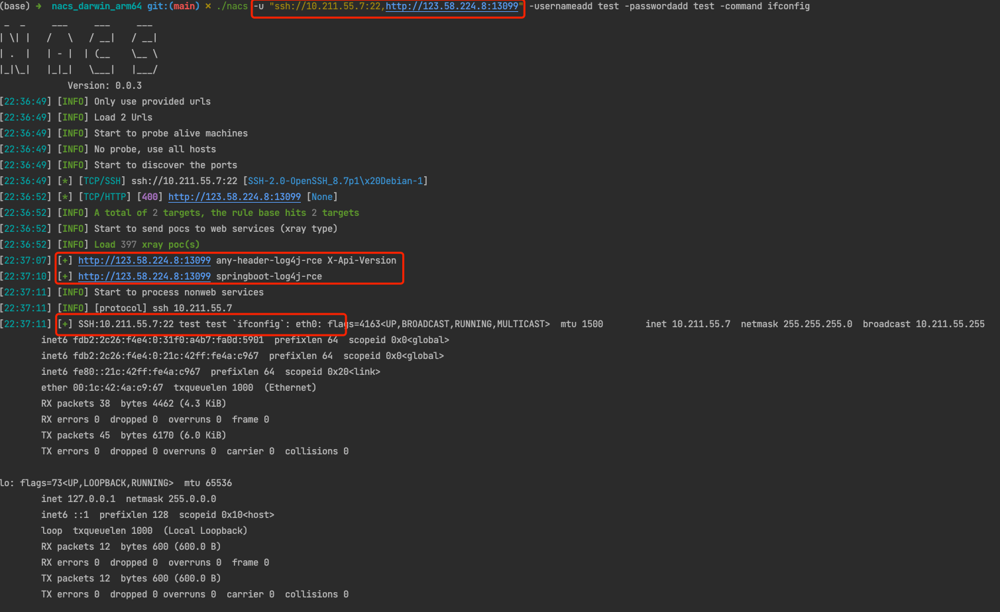

# nacs: event-driven penetestg scanner

[[中文 Readme]](https://github.com/u21h2/nacs/README.md)
|
[[English Readme]](https://github.com/u21h2/nacs/README_EN.md)


<a href="https://github.com/u21h2/nacs"></a>
<a href="https://github.com/u21h2/nacs/releases"></a>
<a href="https://github.com/u21h2/nacs"></a>

## ✨ Features
- Detect if the target machine is alive
- Service scan (regular & non-regular ports)
- poc detection (xray & nuclei format)
- Weak password blasting for services such as databases
- Common Vulnerability Exploitation of Intranet


## ⭐️ Highlights
- Log4j vulnerability detection of common components and common HTTP request headers
  
- Service scanning and utilization of unconventional ports (such as ssh on port 2222, etc.)
- Retrieve available assets from fofa as a supplement (TODO)
- Automatically identify the input box of a simple web page for weak password blasting and log4j detection (TODO)


# Mechanism
    Environment configuration
        Weak password configuration, public key to be written, bounced address, ceye's API, etc.
    detect alive
        icmp ping
    fingerprint scan
        Determine which port corresponds to which service, especially unconventional ports
    Vulnerability management (sent to the corresponding module according to the fingerprint information)
        Detect or exploit non-web services that can be RCE (redis, EternalBlue, etc.)
        PoC scanning of web services, such as log4j
        Unauthorized and blasting of non-web services
        Auto-explosive login (TODO) for web services
        Key services OA, VPN, Weblogic, honeypot, etc.


## Instructions

### Quick start
```
sudo ./nacs -h "IP or IP segment" -o result.txt
sudo ./nacs -hf "File of IP or IP segment" -o result.txt
sudo ./nacs -u url(s) -o result.txt
sudo ./nacs -uf "File of url(s)" -o result.txt
```

### Demo
- (1) Add target IP: scan the 10.15.196.135 machine, manually add the password, and turn off the test of the reverse platform (ie not test log4j, etc.)
    ```
    sudo ./nacs -h 10.15.196.135 -passwordadd "xxx,xxx" -noreverse
    ```
  
  It can be seen that nacs discovered the permission bypass vulnerability of nacos and successfully blasted each service

- (2) Add the target url directly: Blast the ssh port of 10.211.55.7, add the username and password as test, and execute ifconfig after the blasting is successful; try the log4j vulnerability on a shooting range url
  ```
  sudo ./nacs -u "ssh://10.211.55.7:22,http://123.58.224.8:13099" -usernameadd test -passwordadd test -command ifconfig
  ```
  
  It can be seen that the two log4j pocs are successfully detected, and the injection point is in the X-Api-Version field of the request header; the blasting of ssh is also successful

### Common parameters
```
-o output log file
-np do not perform liveness detection, directly scan the port
-po use only these ports
-pa add these ports
-fscanpocpath The poc path of fscan is in the format "web/pocs/"
-nucleipocpath nuclei's poc path format is "xxx/pocs/**"
-nopoc do not perform poc detection, including xray and nuclei
-nuclei Use nuclei for detection (it is not strongly recommended to add this parameter, because nuclei has too many pocs)
-nobrute do not blast
-pocdebug print all information when poc probes
-brutedebug print all information when blasting
-useradd add username when blasting
-passwordadd add password when blasting
-noreverse do not use reverse platform
```

## Reference
Inspired by the following excellent tools
- [x] fscan https://github.com/shadow1ng/fscan
- [x] kscan https://github.com/lcvvvv/kscan
- [x] dismap https://github.com/zhzyker/dismap
- [ ] Ladon https://github.com/k8gege/LadonGo
- [x] xray https://github.com/chaitin/xray
- [ ] goby https://cn.gobies.org/
- [x] vulmap https://github.com/zhzyker/vulmap
- [ ] nali https://github.com/zu1k/nali
- [ ] ehole https://github.com/EdgeSecurityTeam/EHole
- [x] Nuclei https://github.com/projectdiscovery/nuclei
- [x] pocV https://github.com/WAY29/pocV
- [x] afrog https://github.com/zan8in/afrog
- [ ] woodpecker https://github.com/Ciyfly/woodpecker
- [x] xray-poc-scan-engine https://github.com/h1iba1/xray-poc-scan-engine
- [x] pocassist https://github.com/jweny/pocassist
- [ ] Aopo https://github.com/ExpLangcn/Aopo
- [x] SpringExploit https://github.com/SummerSec/SpringExploit
- [ ] fscanpoc-expansion  https://github.com/chaosec2021/fscan-POC


# TODO dynamic update
- [ ] Automatically scan and collect assets from fofa to supplement the scan results
- [ ] Support custom header for host collision, etc.
- [ ] Improve the proxy function
- [ ] Add progress bar
- [ ] Support xrayV2
- [ ] Supports the automatic generation of weak passwords, and dynamically supplements the explosive dictionary according to prefixes, suffixes, acquired information, etc.
- [ ] Automatic exploitation of common Spring vulnerabilities
- [ ] Simple web login service automatically detects interfaces and parameters to achieve blasting
- [ ] ...

# Stargazers over time
[](https://starchart.cc/u21h2/nacs)
